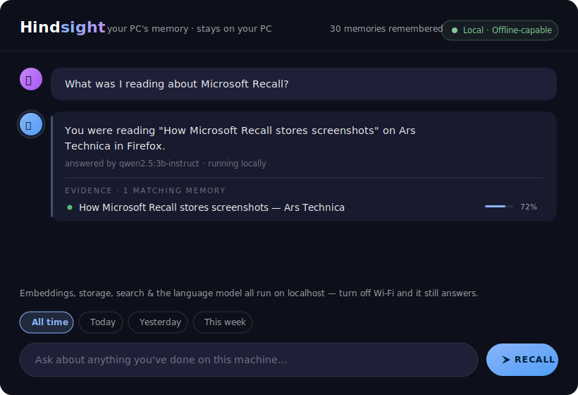

# Hindsight 🧠

**A photographic memory for your PC — that never leaves your PC.**

Hindsight quietly watches what you do on your machine (window titles, clipboard, browser history — screenshots+OCR optional), stores everything in [Supermemory Local](https://supermemory.ai/docs/self-hosting/overview), and lets you ask questions about your own past in plain English:

> *"What was that article about embeddings I read on Tuesday?"*
> *"What was I working on before lunch?"*
> *"Where did I copy that API key from?"* 😬

Think Microsoft Recall — except **nothing ever leaves your machine**. No cloud, no telemetry, no trust required. Turn off your Wi-Fi and it keeps working. That's the whole point.

Built for the **Supermemory localhost:6767 hackathon** (July 9–13, 2026).

---

## See it in action



Ask in plain English; get a cited answer plus an **evidence timeline** — the real
memories behind it, each with a timestamp, source, and relevance score:

| You ask | Hindsight answers (from your own activity) |
| --- | --- |
| *"What was I reading about Microsoft Recall?"* | "How Microsoft Recall stores screenshots" — Ars Technica |
| *"Was I in any meetings?"* | Zoom Meeting — Supermemory hackathon office hours |
| *"What Supermemory docs did I look at?"* | Supermemory self-hosting overview |
| *"What did I read about vector search & embeddings?"* | the HNSW article, the bge model card, a copied cosine-similarity formula |
| *"What did I copy to my clipboard?"* | `npx supermemory local`, the submission form link, … |

> 📹 **Demo video:** _add your recording here_ — see [`docs/DEMO.md`](docs/DEMO.md)
> for the 3‑minute script (including the "turn the Wi‑Fi off, it still answers" moment).
> To drop in a real screen capture, save it as `docs/demo.gif` and swap the image link above.

---

## Why this exists

Microsoft Recall caused a privacy firestorm because a searchable log of everything you do is *incredibly useful* and *terrifying to put in anyone else's hands*. The answer isn't "don't build it" — it's **build it so it physically can't phone home**.

Supermemory Local makes that possible: embeddings, storage, and hybrid semantic search all run in one binary on localhost. Hindsight is the memory layer your PC always should have had.

## Features

- **Ask your past** — natural-language questions answered by a local model, every claim backed by an evidence timeline with timestamps, sources, and relevance bars.
- **Live capture feed** — a drawer that tails the newest memories by insertion time; copy something and watch it appear in real time, then ask about it.
- **Time-scoped recall** — filter chips (Today / Yesterday / This week / All time) filter candidates by each memory's `captured_at` before answering.
- **Daily digest** — "Summarize my day" narrates a whole day's memories, grouped by site and app, each line backed by evidence.
- **Privacy control center** — pause capture, per-source toggles (browser / window / clipboard / OCR), per-domain exclusions, per-memory delete, and one-click Forget-all. Your memory, your rules.
- **100% local & offline** — on-device embeddings + storage + search via Supermemory Local, and a local LLM. Turn the Wi-Fi off; it still works.

## Architecture

```
┌─────────────────────────────── your machine ───────────────────────────────┐
│                                                                             │
│  ┌──────────────┐   events    ┌──────────────────┐   /v4/memories           │
│  │ capture      │ ──────────► │ batcher / dedupe │ ───────────────┐         │
│  │ daemon       │             │ + privacy filter │                ▼         │
│  │  · windows   │             └──────────────────┘   ┌────────────────────┐ │
│  │  · clipboard │                                    │ Supermemory Local  │ │
│  │  · browser   │                                    │  localhost:6767    │ │
│  │  · ocr (opt) │                                    │  embeddings+search │ │
│  └──────────────┘                                    └────────┬───────────┘ │
│                                                               │ /v4/search  │
│  ┌──────────────┐    ask      ┌──────────────────┐            │             │
│  │ web UI       │ ──────────► │ answer engine    │ ◄──────────┘             │
│  │ (chat +      │ ◄────────── │ (Ollama local ·  │                          │
│  │  timeline)   │   answer    │  extractive f/b) │                          │
│  └──────────────┘             └──────────────────┘                          │
│                                                                             │
└──────────────────────────── nothing leaves ─────────────────────────────────┘
```

## Privacy, by construction

- **All storage & search:** Supermemory Local on `localhost:6767`. Works offline.
- **Pause capture:** a switch in the app bar; the daemon stops immediately (shared via `.hindsight/state.json`).
- **Per-source toggles:** turn browser / window / clipboard / OCR capture on or off.
- **Exclusion list:** add domains or app names (e.g. your bank) that are never captured; secrets (API keys, private keys, credit-card numbers) and password managers are dropped by default.
- **Delete anything:** one memory (delete icon on any evidence row), or all of it (Forget all).

## Quickstart

Supermemory Local's binary is Linux/macOS-only, so on Windows it runs inside
WSL2 while Hindsight runs natively. Full steps are in [SETUP.md](SETUP.md);
the short version:

```powershell
# 1. One-time: install the Linux side (Supermemory Local + Ollama) in WSL2
#    → see SETUP.md

# 2. Start the server (boots Supermemory + Ollama in WSL, writes the API key)
scripts\start_supermemory.ps1        # → http://localhost:6767

# 3. Install & run Hindsight (native Windows)
pip install -r requirements.txt
py -m hindsight.capture              # start remembering  (Ctrl+Break pauses)
py -m hindsight.app                  # ask questions → http://localhost:8787
```

## Testing

```powershell
py scripts\smoke_test.py    # add -> search -> forget round-trip (self-cleaning)
py scripts\api_test.py      # 38 checks: every endpoint's happy path + malformed
                             # inputs (no 500s), evidence-field shape, XSS-escape
                             # logic, 5-way concurrency
py scripts\demo_check.py    # the scripted DEMO.md queries still return their
                             # expected evidence, plus time-scope + digest checks
```

Full results (every check, with evidence) are in [`docs/TEST_REPORT.md`](docs/TEST_REPORT.md).

## How it uses Supermemory Local

Every captured event (window focus, clipboard snippet, page visit, optional
OCR text) is phrased as a factual sentence and stored as a memory via
Supermemory Local's `POST /v4/memories` — embedded **on-device** (the bundled
`bge` model) into Supermemory's encrypted local store. Recall goes well beyond
store-and-search: questions hit `POST /v4/search` for semantic recall (with a
cited evidence timeline); **time-scoped** questions filter those candidates by
each memory's `captured_at`; the **live feed** and **daily digest** list
memories by insertion and capture time; and user control — **per-memory
delete** via `DELETE /v4/memories`, plus pause / per-source / per-domain
capture gating — runs against the same local container. Answers are
synthesized by a local model (Ollama) with an instant extractive fallback.
Everything runs on `localhost:6767`, so it keeps working with the Wi‑Fi off.
Supermemory Local isn't a feature of Hindsight; it's the reason it can exist.

## Changelog

**Pre-submission verification (July 11)**
- Added `scripts/api_test.py` (38 checks: every endpoint's happy path + abuse
  cases, evidence-field shape, XSS-escape logic, 5-way concurrency) and
  `scripts/demo_check.py` (scripted demo anchors + time-scope + digest);
  full results in `docs/TEST_REPORT.md`.
- Hardened evidence/live-feed rendering against injected content (`esc()` now
  escapes quotes so attribute-context breakout isn't possible); verified live
  in-browser with an XSS payload — zero execution, in the thread, evidence
  list, and live feed.
- Privacy filter now also drops credit-card-shaped clipboard content (was
  only catching API keys/tokens/private keys).
- Fixed `scripts/smoke_test.py` to match the current client API (was calling
  a removed method) and made it self-cleaning.

**Feature sprint (July 11) — deeper Supermemory usage + the privacy story**
- **Live capture feed** — `GET /api/recent`; a drawer tails the newest memories in real time (copy → appears → ask).
- **Time-scoped questions** — Today / Yesterday / This week filter chips; `/api/ask` filters `/v4/search` candidates by `captured_at`.
- **Daily digest** — `POST /api/digest`; "Summarize my day" narrates a day's memories grouped by site/app, with an instant extractive fallback.
- **Privacy control center** — pause capture, per-source toggles, per-domain exclusions (`/api/settings` + a shared state file the daemon honors), and per-memory delete (`/api/forget_one`).
- Seeded the demo container to **540 memories**.

**Initial build (July 9–10)**
- Windows capture daemon (window titles, clipboard, Chromium history, opt-in on-device screenshot OCR) with privacy filters.
- FastAPI query app + Material Design single-file UI (ripple, elevation, dialog, floating label, a11y).
- Supermemory Local in WSL2 with on-device embeddings; local Ollama (qwen2.5:3b) answers with extractive fallback; evidence timeline with relevance bars.

## Team

- Meet Kapadia — solo

## License

MIT
